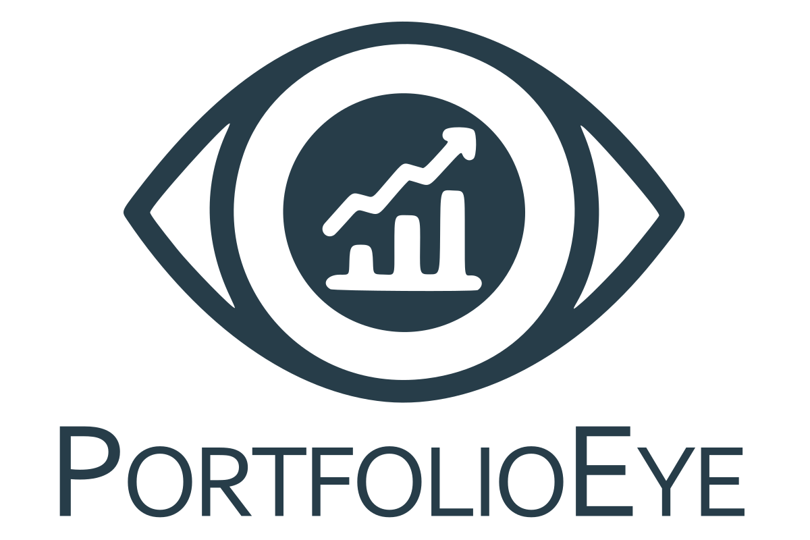

# PortfolioEye

  

---

PortfolioEye is an open-source application for tracking investment portfolios, created with individual investors in mind. Our goal is to provide you with a comprehensive tool for monitoring and analyzing your investments across various asset classes. With PortfolioEye, managing your investment portfolio becomes easier, safer, and more intuitive.  

## Features

PortfolioEye offers a range of features to help you track and analyze your investments:  
- **Multiple Portfolios**: Ability to create and manage multiple investment portfolios in one place.
- **Support for Various Asset Classes**: Initially, the application will support stocks and bonds. Other classes such as cryptocurrencies, real estate, etc., will be available in the future.
- **Intuitive Interface**: An easy-to-use interface allows for quick adding, editing, and analyzing your investments.
- **Privacy**: With the option for self-hosting, you have full control over your data. Your information is secure and private.

## Plans / Roadmap

The project was created as my participation in the 100 commits competition. Due to lack of time, the work is not progressing at the expected pace. By the end of the competition, I would like the project to have the following functionalities:

- [X] Basic application layout
- [X] User accounts
- [X] Portfolio management
- [X] Account management
- [X] Fetching exchange rates from NBP
- [X] Adding stock purchases
- [X] Fetching current stock prices (possibly using Yahoo API)
- [X] Calculating current stock values
- [ ] Adding purchases of Polish retail treasury bonds
- [ ] Calculating the current value of bonds
- [ ] Calculating the current value of portfolios

## Demo

The demo is available at https://demo.portfolioeye.app/
To log in, use these credentials:
- Login: demo@portfolioeye.app
- Password: Demo!23

## Installation

TBA

## Development

TBA  

## Tech

PortfolioEye is written in C# using Blazor WebAssembly. Data is stored in a PostgreSQL database.  

## Contributing

PortfolioEye is an open-source project, and I encourage collaboration! If you want to help develop the application, you can do so in several ways:  
- **Bug Reporting**: If you find a bug, report it in the Issues section.
- **Proposing New Features**: Have an idea for a new feature? Let me know through Issues.

## Contact

If you want to contact me, you can send an email to art.skoczylas[at]gmail.com 

## License

PortfolioEye is available under the AGPLv3 license.
